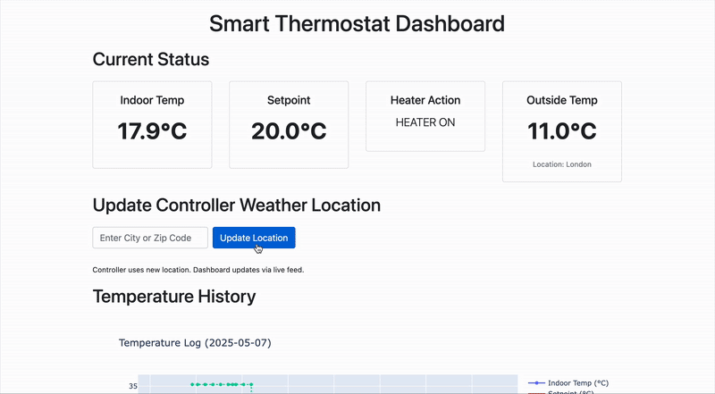

# Simulated Smart Thermostat Controller



This project simulates a single-zone smart thermostat system using Python, MQTT, and a Flask-based web dashboard. It demonstrates how software can control heating by processing simulated sensor data, incorporating external weather information, and providing a user interface for monitoring and control.

## Goals
- Automate heating decisions for a single room based on simulated sensor data and a dynamic setpoint.
- Integrate real-time external weather data to influence the heating setpoint.
- Provide a web dashboard for live monitoring of temperature, setpoint, heating status, and outside conditions.
- Allow users to update the weather location for the controller via the web dashboard.
- Demonstrate a decoupled architecture using MQTT for messaging between components.

## Architecture
The system consists of three main Python components and an MQTT broker:

1.  **Sensor (`sensor/sensor.py`):**
    *   Simulates room temperature data using a random walk.
    *   Publishes these temperature readings as JSON messages (e.g., `{"temperature": 21.5}`) to an MQTT topic (`home/1/temperature`) at regular intervals.
    *   Uses Python's `logging` module for output.

2.  **Controller (`controller/controller.py`):**
    *   Subscribes to a command topic (`smart_thermostat/controller/command`) to receive instructions, such as updating the weather location.
    *   Fetches real-time weather data from [WeatherAPI.com](https://www.weatherapi.com/) for a specified location.
    *   Dynamically adjusts a global heating setpoint based on the fetched outside temperature (e.g., if outside < 5°C, setpoint decreases; if > 18°C, setpoint increases).
    *   Periodically (e.g., every minute) re-fetches weather data, adjusts the setpoint, and publishes its comprehensive status (current location, setpoint, last outside temperature) to an MQTT topic (`smart_thermostat/controller/status_feed`).
    *   Uses Python's `logging` module for output.

3.  **Web Application & Data Hub (`app.py`):**
    *   A Flask application that serves as the central hub for data processing, logging, and the user interface.
    *   **MQTT Subscriber:** Subscribes to the sensor's temperature data (`home/1/temperature`) and the controller's status feed (`smart_thermostat/controller/status_feed`).
    *   **Data Processor & Logger:**
        *   When sensor data arrives, it determines the heating action ("HEATER ON" / "HEATER OFF") by comparing the indoor temperature against the latest setpoint received from the controller.
        *   Logs all processed sensor events (including the determined action and relevant controller status at that time) and controller status updates to a daily SQLite database (e.g., `database/temperature_log_YYYY-MM-DD.db`).
    *   **Web Dashboard (`templates/index.html`):**
        *   Displays live indoor temperature, current setpoint, determined heater action, outside temperature, and current weather location.
        *   Uses Server-Sent Events (SSE) to update dashboard values in real-time without page reloads.
        *   Presents a Plotly chart showing historical temperature trends from the current day's database.
        *   Includes a form to update the weather location used by the `controller.py`.
    *   **MQTT Publisher:** Publishes commands (e.g., `UPDATE_LOCATION`) to the controller's command topic when the user updates the location via the dashboard.
    *   Uses Python's `logging` module.

4.  **MQTT Broker (e.g., Mosquitto):**
    *   Acts as the message bus, relaying temperature data, controller status, and commands between the components.

## Tools & Technologies
- Python 3
- Paho MQTT client library (`paho-mqtt`)
- Flask (for the web application and SSE)
- Plotly (for charting on the dashboard)
- Requests (for fetching weather API data)
- python-dotenv (for managing API keys and environment variables)
- SQLite (for daily data logging)
- Mosquitto (or any MQTT broker)
- Git & GitHub

## Setup and Running the System

### 1. Prerequisites
- Python 3 and `pip` installed.
- Git installed.

### 2. Clone the Repository
```bash
git clone <repository_url>
cd <repository_directory>
```

### 3. Set up Python Virtual Environment & Install Dependencies
It's highly recommended to use a virtual environment:
```bash
python3 -m venv my_env
source my_env/bin/activate  # On Windows: my_env\\Scripts\\activate
pip install -r requirements.txt
```

### 4. MQTT Broker Setup (Mosquitto)
These instructions are for macOS using Homebrew. For other operating systems, refer to the [official Mosquitto download page](https://mosquitto.org/download/).

1.  **Install Mosquitto:**
    ```bash
    brew install mosquitto
    ```

2.  **Run Mosquitto:**
    You have two main options:
    *   **Option A: Run as a background service (recommended for general use):**
        ```bash
        brew services start mosquitto
        ```
        To stop: `brew services stop mosquitto`
        To restart: `brew services restart mosquitto`

    *   **Option B: Run manually in the foreground (useful for development to see live logs):**
        Open a new terminal window and run:
        ```bash
        /opt/homebrew/opt/mosquitto/sbin/mosquitto -c /opt/homebrew/etc/mosquitto/mosquitto.conf
        ```
        (The path might vary based on your installation. For default Homebrew on Apple Silicon, it's often `/opt/homebrew/sbin/mosquitto`. For Intel, `/usr/local/sbin/mosquitto`.)
        You should see log output. Press `Ctrl+C` to stop. The default MQTT port is `1883`.

### 5. WeatherAPI.com Configuration
The controller fetches real-time weather data to adjust the heating setpoint.

1.  **Sign up for a Free API Key:**
    *   Go to [WeatherAPI.com](https://www.weatherapi.com/) and register.

2.  **Create and Configure `.env` file:**
    *   In the root project directory, create a file named `.env`.
    *   Add your API key:
        ```env
        WEATHER_API_KEY="YOUR_ACTUAL_API_KEY"
        ```
        Replace `YOUR_ACTUAL_API_KEY` with your key.
    *   The initial weather location is hardcoded in `controller/controller.py` (e.g., "London") but can be changed dynamically via the web dashboard. The `.env` file is *only* for the API key.
    *   The `.env` file is included in `.gitignore` and should **not** be committed.

    If `WEATHER_API_KEY` is missing or empty, the controller will skip weather fetching and use a default setpoint.

### 6. Running the Application Components
You'll need to run the three Python scripts in separate terminal windows/tabs. Ensure your virtual environment is activated in each.

1.  **Start the Sensor:**
    ```bash
    python sensor/sensor.py
    ```
    This will start publishing simulated temperature data.

2.  **Start the Controller:**
    ```bash
    python controller/controller.py
    ```
    This will subscribe to commands, fetch weather, adjust setpoints, and publish its status.

3.  **Start the Flask Web Application:**
    ```bash
    python app.py
    ```
    This will start the web server (usually on `http://127.0.0.1:5001`).

### 7. Accessing the Dashboard
Open your web browser and navigate to `http://127.0.0.1:5001` (or the address shown in the `app.py` console output).
You should see:
- Live temperature readings.
- Current setpoint temperature (influenced by outside weather).
- Heater action status (ON/OFF).
- Outside temperature and weather location.
- A form to update the weather location for the controller.
- A chart of recent temperature history.

## Development Notes
- All components use Python's `logging` module. Check the console output of each script for detailed information and potential errors.
- The `app.py` Flask application runs in debug mode by default, which enables the auto-reloader. MQTT client initialization has been structured to work correctly with this reloader.
- Database files are created daily in the `database/` directory (e.g., `database/temperature_log_2025-05-07.db`).

## Potential Extensions
- Add user authentication for the dashboard.
- Implement more sophisticated heating schedules or learning algorithms in the controller.
- Allow configuration of multiple temperature zones.
- Persist controller settings (like location) across restarts more robustly if needed beyond in-memory.
- Replace simulated sensor data with real hardware (e.g., Raspberry Pi with a temperature sensor).


